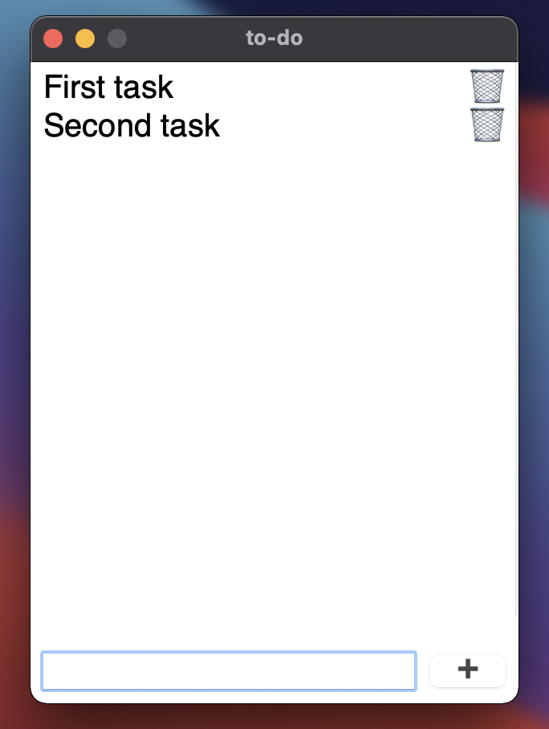
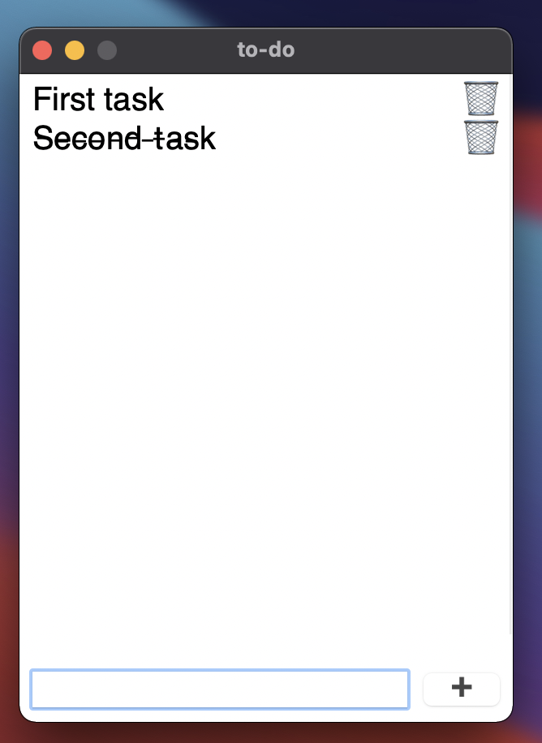

# Clean to-do app with Python with GUI by built-in tkinter module

## Table of Contents
* [Technologies Used](#technologies-used)
* [Features](#features)
* [Screenshots](#screenshots)
* [Room for Improvement](#room-for-improvement)
* [Contact](#contact)
<!-- * [License](#license) -->

## Technologies Used
- Python 3.9
- Python tkinter built-in module

## Features
- Adding new task
- Deleting new task
- Making task done - crossing it
- Tasks are written to text file

## Screenshots

## Room for Improvement

To do:
- Adding feature to send tasks to our mail
- Voice input
- Different lists
- Adding notifications 

## Contact
Mail: michvlbbb@gmail.com
